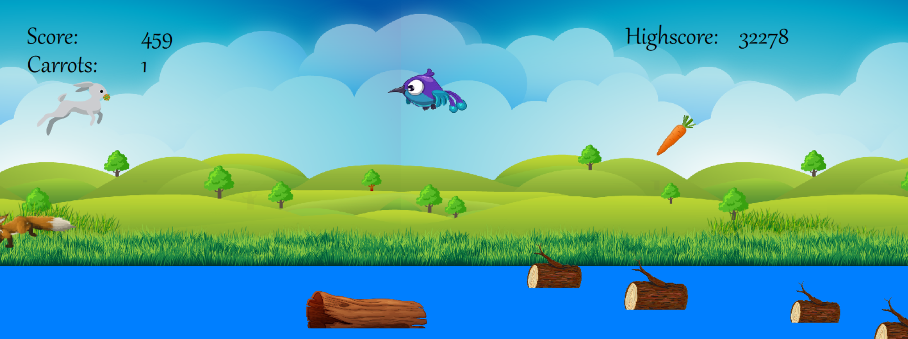
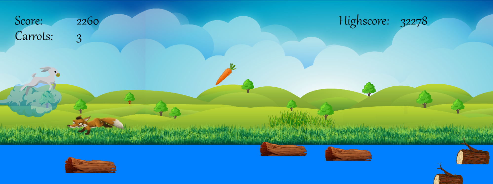

# Bunny Game

This project was part of a group project during high school. The assignment was to create a simple game in Java, following provided templates. 
However, we decided to take a different approach and developed the game in C++. We tried to build our own Direct2D Engine and utilized it to create a straightforward Runner game.

  
  

As already mentioned, the game is a basic runner game where the player controls a bunny that continuously moves forward. 
The gameplay involves dodging various obstacles while being pursued by a fox and a bird. The bunny can collect carrots, each granting an additional jump. 
Pressing the up arrow for a variable duration allows the bunny to jump, while pressing the down arrow accelerates its descent. Special effects can be acquired by stepping onto mushrooms. Pressing F9 restarts the game.

## Running the game
To run the game, simply open the direct2d.sln file in Visual Studio and run the code.
